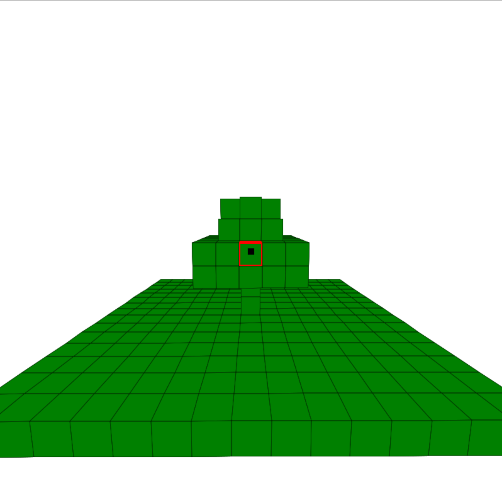
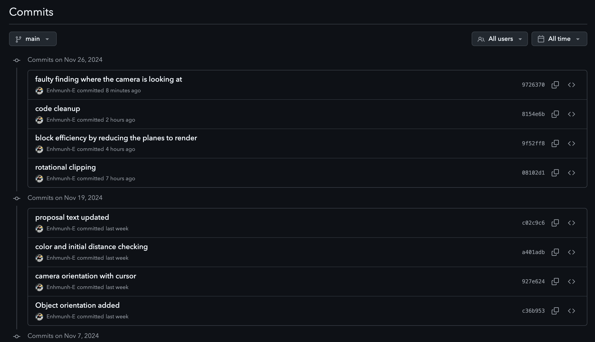

# Project Name: PixelBuild

PixelBuild is a unique game concept that combines the block-building mechanics of Minecraft with the competitive gunplay style of Valorant. This hybrid gameplay creates an immersive experience where players can engage in both world-building and strategic combat.

## What does the game do:

PixelBuild is a voxel-based game that allows players to interact with a dynamic 3D world. Players can:

- Place, delete, or modify blocks to shape their environment.
- Engage in combat using a variety of weapons, blending creativity with competitive gameplay.

This combination of sandbox-style building and tactical gunplay makes PixelBuild a versatile and engaging experience for players who enjoy both genres.

## Competitive Analysis:

There is a mobile game called PixelGun where it combines guns with blocks, the same principle for my game. However, on PixelGun it does not allow users to modify the game world in game, not giving immersive experience. There are also valorant mods in Minecraft where Valorant is implemented in them as an addition.
Also, if it wasn't a block game, then it would be similar to Fortnite.

The main component that my game is different than the following games is that, it will have blocks in which are breakable also, you can't put any blokcs in game. By adding guns, it will provide more creative gameplay and thus be more favorable to the people.

## Structural Plan:

Project will be organized in a way that it is categorized depending on the usage.
For example:
I will have util functions on one file, classes on another and base cmu_graphics on the other so that all the files are sorted and easy to understand. I will also add assets folder in which I will add my objects and pictures.

## Algorithmic plan:

The trickiest part would be implementing camera orientation for selecting a block. I would approach this through geometric formula where it could find the intersection of a camera line to the plane.

## Timeline plan:

- tp1: base graphics
- tp2: upgraded graphics
- tp3: creative update

## Version Control Plan:

To ensure efficient coding and backup:

- The project uses Git for version control.
- Code is hosted on a private GitHub repository.
- Features are developed incrementally, with regular commits and pushes to the main branch after testing.

  [Link to Github Repository](https://github.com/Enhmunh-E/112-term-project)

## Module List:

    cmu_graphics
    copy
    math

## Algorithms Used:

- [Cohen Sutherland Algorithm](https://en.wikipedia.org/wiki/Cohen%E2%80%93Sutherland_algorithm) for line clipping

- [Perspective Projection](https://en.wikipedia.org/wiki/3D_projection) for rendering on screen

- [Painter's Algorithm](https://en.wikipedia.org/wiki/Painter%27s_algorithm#:~:text=Similarly%2C%20the%20painter's%20algorithm%20sorts,this%20order%2C%20farthest%20to%20closest.) for rendering order

## Pictures

### GamePlay

### Version Control

